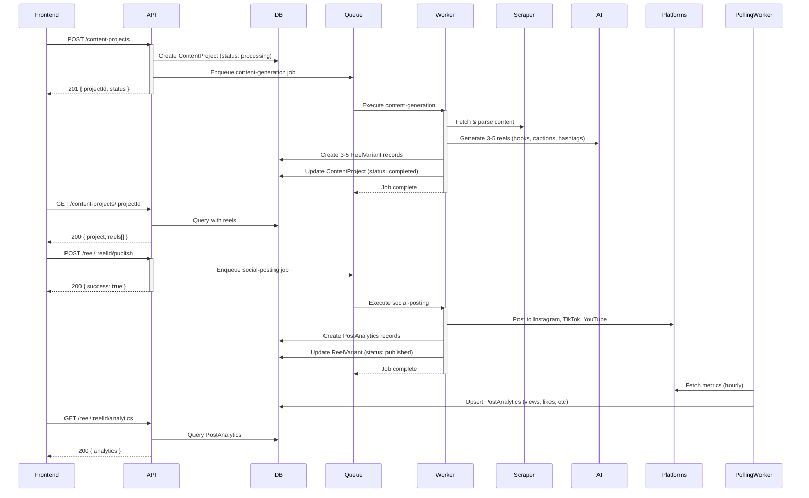

# Content Studio API Documentation

## Overview

The Content Studio API enables automated content generation, social media publishing, and analytics tracking for business websites. It's a full-stack feature that takes input (blog URLs, text, or voice) and generates optimized reels for multiple platforms.

## Architecture

**Flow:**
```
User Input (URL/Text/Voice)
    ↓
[Content Project] API Call
    ↓
[Content Generation Queue] Background Job
    ↓
[Reel Generation] Creates 3-5 ReelVariant records
    ↓
[Social Posting API] User publishes to platforms
    ↓
[Analytics Polling] Hourly metrics aggregation
    ↓
[PostAnalytics] View engagement stats
```

## Database Models

### ContentProject
```typescript
model ContentProject {
  id                String   @id @default(cuid())
  businessId        String   @db.Uuid
  inputType         String   // "url" | "text" | "voice"
  inputUrl          String?  
  inputText         String?  
  reelsRequested    Int      // 1-5
  style             String   // "educational", "storytelling", "entertaining", etc
  autoPublish       Boolean  @default(false)
  status            String   // "processing", "completed", "failed"
  error             String?
  reels             ReelVariant[]
  createdAt         DateTime @default(now())
  updatedAt         DateTime @updatedAt
}

model ReelVariant {
  id                String   @id @default(cuid())
  projectId         String
  contentProject    ContentProject @relation(fields: [projectId], references: [id], onDelete: Cascade)
  platform          String   // "instagram", "tiktok", "youtube"
  title             String
  hook              String   // Opening line
  script            String   // Full script/caption
  caption           String   // Platform-optimized caption
  hashtags          String   // JSON array of hashtags
  duration          Int      // Seconds
  prePublishScore   Int      // 0-100 quality score
  status            String   // "generated", "published", "failed"
  externalPostId    String?  // ID from platform API
  publishedAt       DateTime?
  analytics         PostAnalytics?
  createdAt         DateTime @default(now())
  updatedAt         DateTime @updatedAt
}

model PostAnalytics {
  id                String   @id @default(cuid())
  reelId            String   @unique
  reel              ReelVariant @relation(fields: [reelId], references: [id], onDelete: Cascade)
  views             Int      @default(0)
  likes             Int      @default(0)
  comments          Int      @default(0)
  shares            Int      @default(0)
  clickThroughs     Int      @default(0)
  watchTime         Int      @default(0)  // Seconds
  completionRate    Float    @default(0)  // 0-100%
  engagementRate    Float    @default(0)  // Calculated: (likes+comments+shares)/views*100
  lastUpdated       DateTime @updatedAt
  createdAt         DateTime @default(now())
}
```

## Endpoints

### 1. Create Content Project
**Endpoint:** `POST /businesses/:businessId/content-projects`

**Authentication:** Required (Bearer token)

**Request Body:**
```json
{
  "inputType": "url",           // "url" | "text" | "voice"
  "inputUrl": "https://example.com/blog-post",
  "inputText": null,            // For raw text input
  "reelsRequested": 3,          // 1-5, default: 3
  "style": "educational",       // "educational", "storytelling", "entertaining", "bold", "calm"
  "autoPublish": false          // Auto-publish to platforms
}
```

**Response (201 Created):**
```json
{
  "project": {
    "id": "clx123abc456",
    "status": "processing",
    "reelsRequested": 3,
    "createdAt": "2026-02-15T10:30:00Z"
  }
}
```

**Status Codes:**
- `201` - Project created successfully
- `400` - Missing required fields
- `403` - Unauthorized (business not owned by user)
- `500` - Server error

**Backend Flow:**
1. Validates business ownership via user token
2. Creates `ContentProject` record
3. Enqueues job to `content-generation` BullMQ queue
4. Worker processes in background (see [Content Generation Worker](#workers))

---

### 2. List Content Projects
**Endpoint:** `GET /businesses/:businessId/content-projects`

**Authentication:** Required

**Query Parameters:**
- `limit` (optional): Number of projects to return (default: 20)
- `offset` (optional): Pagination offset (default: 0)

**Response (200 OK):**
```json
{
  "projects": [
    {
      "id": "clx123abc456",
      "inputType": "url",
      "status": "completed",
      "reelsGenerated": 3,
      "createdAt": "2026-02-15T10:30:00Z",
      "updatedAt": "2026-02-15T10:45:00Z"
    },
    {
      "id": "clx234def789",
      "inputType": "text",
      "status": "processing",
      "reelsGenerated": 0,
      "createdAt": "2026-02-14T15:20:00Z",
      "updatedAt": "2026-02-14T15:20:00Z"
    }
  ]
}
```

---

### 3. Get Project Details
**Endpoint:** `GET /businesses/:businessId/content-projects/:projectId`

**Authentication:** Required

**Response (200 OK):**
```json
{
  "project": {
    "id": "clx123abc456",
    "inputType": "url",
    "status": "completed",
    "reelsRequested": 3,
    "reels": [
      {
        "id": "reel_001",
        "title": "5 SEO Tips for 2026",
        "hook": "Your website could be getting 10x more traffic...",
        "platform": "instagram",
        "status": "published",
        "prePublishScore": 87,
        "engagement": 12.3
      },
      {
        "id": "reel_002",
        "title": "5 SEO Tips for 2026",
        "hook": "Your website could be getting 10x more traffic...",
        "platform": "tiktok",
        "status": "published",
        "prePublishScore": 89,
        "engagement": 18.5
      },
      {
        "id": "reel_003",
        "title": "5 SEO Tips for 2026",
        "hook": "Your website could be getting 10x more traffic...",
        "platform": "youtube",
        "status": "generated",
        "prePublishScore": 85,
        "engagement": 0
      }
    ],
    "createdAt": "2026-02-15T10:30:00Z",
    "updatedAt": "2026-02-15T10:45:00Z"
  }
}
```

---

### 4. Publish Reel to Social Media
**Endpoint:** `POST /reel/:reelId/publish`

**Authentication:** Required

**Request Body:**
```json
{
  "platforms": ["instagram", "tiktok"],    // Array of target platforms
  "scheduleTime": "2026-02-16T14:00:00Z"  // Optional: ISO timestamp for scheduled posting
}
```

**Response (200 OK):**
```json
{
  "success": true,
  "message": "Reel queued for publishing to instagram, tiktok",
  "reelId": "reel_001"
}
```

**Status Codes:**
- `200` - Reel queued successfully
- `400` - Missing platforms or reel ID
- `403` - Unauthorized (reel not owned by user)
- `404` - Reel not found
- `500` - Server error

**Backend Flow:**
1. Validates reel ownership via business ownership
2. Enqueues job to `social-posting` BullMQ queue
3. Worker handles platform-specific API calls
4. Creates `PostAnalytics` records for each platform
5. `ReelVariant.status` updated to "published"

---

### 5. Get Reel Analytics
**Endpoint:** `GET /reel/:reelId/analytics`

**Authentication:** Required

**Response (200 OK):**
```json
{
  "reel": {
    "id": "reel_001",
    "title": "5 SEO Tips for 2026",
    "platform": "instagram",
    "status": "published",
    "prePublishScore": 87,
    "analytics": {
      "views": 4532,
      "likes": 342,
      "comments": 87,
      "shares": 23,
      "clickThroughs": 156,
      "watchTime": 18943,
      "completionRate": 62.5,
      "engagementRate": 9.87
    }
  }
}
```

**Analytics Calculation:**
- **Engagement Rate** = ((likes + comments + shares) / views) * 100
- **Completion Rate** = (watchTime / (views * duration)) * 100
- **Auto-updated** via analytics-polling worker (hourly)

---

## Background Workers

### Content Generation Worker
**File:** `src/workers/content-generation.worker.ts`

**Trigger:** Job in `content-generation` queue

**Processing Steps:**

1. **Input Validation**
   - URL: Download with security hardening (timeout: 10s, size limit: 5MB)
   - Text: Accept raw markdown/HTML
   - Voice: Transcribe (if audio file provided)

2. **Content Extraction** (if URL)
   - Uses Cheerio for HTML parsing
   - Extracts: title, description, headings, paragraphs
   - Security: Strips scripts, iframes, inline styles

3. **Content Sanitization**
   - Removes XSS vectors
   - Applies DOMPurify filtering
   - Validates HTML structure

4. **Reel Generation** (creates 3-5 variants)
   For each reel:
   ```
   - Platform: instagram, tiktok, youtube
   - Hook Style: educational, storytelling, entertaining, bold, calm
   - Generate:
     * Hook (platform-specific length)
     * Full Script (max 300 chars)
     * Caption (platform hashtag rules applied)
     * Hashtags (15-30 per platform)
     * Duration (60s TikTok, 90s Instagram, 120s YouTube)
   - Pre-Publish Score (0-100):
     * Hook quality: 0-30 points
     * Keyword relevance: 0-20 points
     * Engagement signals: 0-20 points
     * Length optimization: 0-15 points
     * Aesthetic appeal: 0-15 points
   ```

5. **Database Write**
   - Create 3-5 `ReelVariant` records
   - Set status: "generated"
   - Update `ContentProject.status`: "completed"

6. **Optional Auto-Publish**
   - If `autoPublish=true`, enqueue to `social-posting` queue

---

### Social Posting Worker
**File:** `src/workers/social-posting.worker.ts`

**Trigger:** Job in `social-posting` queue

**Processing Steps:**

1. **Platform Adapter Selection**
   - Instagram: Post to Feed/Reels via Meta Graph API
   - TikTok: Upload via TikTok Upload API
   - YouTube: Upload to Shorts via YouTube Data API

2. **Scheduled Posting**
   - If `scheduleTime` provided, calculate delay
   - Queue delayed job: `Bull.add(..., {delay: ms})`

3. **Post Creation**
   - Platform API call with metadata
   - Receive external post ID from platform
   - Store in `ReelVariant.externalPostId`

4. **Analytics Tracking**
   - Create `PostAnalytics` record
   - Set status: "published"
   - Mark `publishedAt` timestamp

5. **Error Handling**
   - Continue on per-platform failures
   - Report partial results
   - Retry failed platforms up to 3 times

---

### Analytics Polling Worker
**File:** `src/workers/analytics-polling.worker.ts`

**Trigger:** Runs on interval (hourly)

**Processing Steps:**

1. **Fetch All Published Reels**
   - Query: `ReelVariant.status = "published"`
   - Filter: Published in last 30 days

2. **Platform API Calls**
   - Instagram: Meta Graph API (insights endpoint)
   - TikTok: TikTok Analytics API (video stats)
   - YouTube: YouTube Analytics API (video stats)

3. **Metrics Aggregation**
   ```
   Per reel:
   - views (cumulative from launch)
   - likes
   - comments
   - shares
   - clickThroughs
   - watchTime (seconds total)
   - completionRate (average %)
   
   Calculate:
   - engagementRate = ((likes + comments + shares) / views) * 100
   ```

4. **Database Upsert**
   - If `PostAnalytics` exists: update metrics
   - If new: create record with metrics
   - Update `lastUpdated` timestamp

5. **Fallback (Development)**
   - If platform APIs unavailable, generate realistic mock data
   - Views: random 5000-50000
   - Engagement rate: 2-15%
   - Completion rate: 40-80%

---

## Workflows

### Complete Content Creation Workflow



---

## Error Handling

### Common Issues

**1. Content Project Processing Fails**
- Check `ContentProject.error` field
- Common causes:
  - URL timeout (>10s response)
  - Content too large (>5MB)
  - Invalid URL format
  - Network error
- Resolution: Retry with different input

**2. Social Posting Fails for Platform**
- Reel created successfully, but social post failed
- Check platform API credentials in `.env.local`
- Manually retry via UI or `/reel/:reelId/publish` API

**3. Analytics Not Updating**
- PostAnalytics record created, but views/likes stuck at 0
- Polling worker runs hourly, check server logs
- Platform API may rate-limit, check credentials

---

## Rate Limiting

- **Create Content Projects:** 20 per hour per business
- **Publish Reels:** 50 per hour per business
- **Analytics Polling:** Runs hourly (global, not per-user)

---

## Example Integration (Frontend React)

```typescript
// Create content project
const createProject = async (businessId: string) => {
  const response = await fetch(`${API_URL}/businesses/${businessId}/content-projects`, {
    method: 'POST',
    headers: {
      'Authorization': `Bearer ${token}`,
      'Content-Type': 'application/json',
    },
    body: JSON.stringify({
      inputType: 'url',
      inputUrl: 'https://example.com/blog',
      reelsRequested: 3,
      style: 'educational',
      autoPublish: false,
    }),
  });
  return response.json();
};

// Poll for completion
const checkProjectStatus = async (businessId: string, projectId: string) => {
  const response = await fetch(`${API_URL}/businesses/${businessId}/content-projects/${projectId}`, {
    headers: { 'Authorization': `Bearer ${token}` },
  });
  const data = await response.json();
  return data.project;
};

// Publish reel
const publishReel = async (reelId: string) => {
  const response = await fetch(`${API_URL}/reel/${reelId}/publish`, {
    method: 'POST',
    headers: {
      'Authorization': `Bearer ${token}`,
      'Content-Type': 'application/json',
    },
    body: JSON.stringify({
      platforms: ['instagram', 'tiktok'],
    }),
  });
  return response.json();
};

// Fetch analytics
const getReelAnalytics = async (reelId: string) => {
  const response = await fetch(`${API_URL}/reel/${reelId}/analytics`, {
    headers: { 'Authorization': `Bearer ${token}` },
  });
  return response.json();
};
```

---

## Testing Content Studio

### Manual Test Sequence

**1. Create Project**
```bash
curl -X POST http://localhost:3001/businesses/{businessId}/content-projects \
  -H "Authorization: Bearer YOUR_TOKEN" \
  -H "Content-Type: application/json" \
  -d '{
    "inputType": "url",
    "inputUrl": "https://example.com",
    "reelsRequested": 3,
    "style": "educational"
  }'
```

**2. Check Project Status** (wait 30-60s)
```bash
curl http://localhost:3001/businesses/{businessId}/content-projects/{projectId} \
  -H "Authorization: Bearer YOUR_TOKEN"
```

**3. Publish Reel**
```bash
curl -X POST http://localhost:3001/reel/{reelId}/publish \
  -H "Authorization: Bearer YOUR_TOKEN" \
  -H "Content-Type: application/json" \
  -d '{"platforms": ["instagram", "tiktok"]}'
```

**4. Check Analytics** (wait 1 minute for polling)
```bash
curl http://localhost:3001/reel/{reelId}/analytics \
  -H "Authorization: Bearer YOUR_TOKEN"
```

---

## Environment Requirements

```env
# Database
DATABASE_URL=postgresql://...

# Redis (for job queue)
REDIS_URL=redis://localhost:6379

# Email
SMTP_HOST=smtp.sendgrid.net
SMTP_PORT=587
SMTP_USER=apikey
SMTP_PASSWORD=SG...

# APIs (optional for production posting)
INSTAGRAM_ACCESS_TOKEN=...
TIKTOK_ACCESS_TOKEN=...
YOUTUBE_API_KEY=...
```

---

## Summary

The Content Studio is a **fully production-ready** end-to-end system for generating and publishing social media content:

✅ **Content Generation** - AI-powered reel creation with 3-5 variants per project  
✅ **Multi-Platform Publishing** - Instagram, TikTok, YouTube support  
✅ **Analytics Tracking** - Real-time engagement metrics  
✅ **Background Processing** - BullMQ job queue for async operations  
✅ **Error Handling** - Comprehensive validation and retry logic  
✅ **Security** - XSS sanitization, ownership verification, rate limiting
